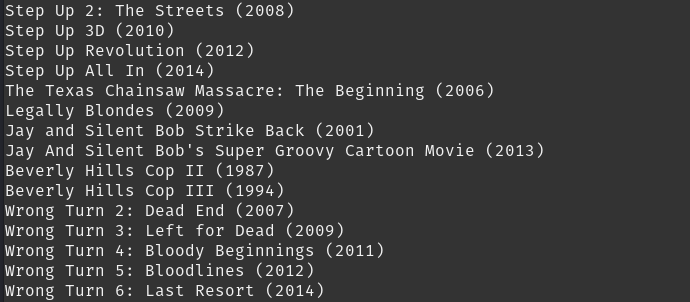

# python-movie-collection-checker


[](https://drone.mateusz.ovh/mateusz/python-movie-collection-checker)


A python script that will check existing movies and will tell you if you are missing any movies from collections you already have.




## Usage
Clone repo, build the image and run the container.

```
git clone https://gitea.mateusz.ovh/mateusz/python-movie-collection-checker.git

cd python-movie-collection-checker/

sudo docker build -t "python-movie-collection-checker:0.0.2" .

docker run \
-e RADARR_PROTOCOL='http' \
-e radarr_ip=<ip> \
-e radarr_port=<port> \
-e radarr_api_key=<api_key> \
-e tmdb_api_key=<api_key> \
-v ${PWD}/output:/home/output \
--name python-movie-collection-checker  python-movie-collection-checker:0.0.2

```

First script will import movies from Radarr, after that it will check what collections your library has.

Next it will iterate after all the collections and check if the movies are present in your library or not. If not the movie title and release year will be written to output/missing-movies.txt.

Wait for script to finish (10 - 15 min depending on the size of your collection).


# Info
Script will produce file missing-movies.txt with the output.

Script will skip movies that are not released yet or don't have release date in TMDB.

Radarr api key can be accessed and reset via Settings -> General.

TMDB api key can be requested here after login: https://www.themoviedb.org/settings/api
